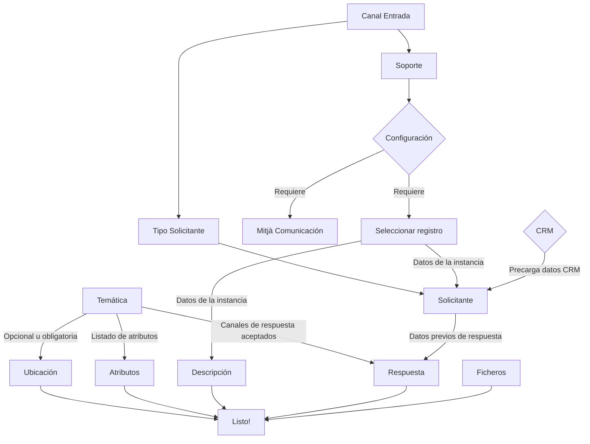

# Creación de fichas

Los diferentes componentes de creación de fichas están ubicados en la carpeta [`components/iris-pages/create`](../../src/components/iris-pages/create). Los tipos de creación son los siguientes:

- **Creación** [`MultiRecordCard.vue`](../../src/components/iris-pages/create/MultiRecordCard.vue): permite la creación de fichas en modo normal o en multificha.
- **Duplicar** [`DuplicateRecordCard.vue`](../../src/components/iris-pages/create/DuplicateRecordCard.vue): alta que recupera los datos de una ficha anterior y los precarga en el formulario.
- **Reclamaciones** [`ClaimRecordCard.vue`](../../src/components/iris-pages/create/ClaimRecordCard.vue): crea una ficha que es la reclamación de otra ficha cerrada.
- **Smartphone:** [`GubAdd.vue`](../../src/components/iris-pages/create/GubAdd.vue): flujo de alta con una maquetación especial para móviles y que sigue un estilo [wizard](../../src/components/form-generator/layout/WizzardFieldset.vue).
- **Dona's la teva opinió** [`AddSurveyCard.vue`](../../src/components/iris-pages/create/AddSurveyCard.vue): permite responder una encuesta que en realidad carga una temática cuyas preguntas son características, quedando guardada como una ficha.
- **Twitter** [`AddRecordCardTwitter.vue`](../../src/components/iris-pages/create/AddRecordCard.vue): permite crear fichas para mensajes recibidos por Twitter, de forma que el operador le sugiere al usuario una temática para crear una ficha, vía mensaje de twitter (integración).

Todos ellos extienden el componente [`AddRecordCard.vue`](../../src/components/iris-pages/create/AddRecordCard.vue) para funcionar.

## Componentes del alta de ficha

La versión más completa del alta es la creación, ya que necesita todos los componentes, mientras que otras como la Twitter muestran una versión ajustada. A continuación se explicarán los campos que entran en juego, su relación con los stores y donde encontrarlos.

- **Bloque 1: Temática y descripción**
  - **[`Árbol de temáticas`](../../src/components/iris-pages/themes/ThemeTreeSelector.vue)**: permite buscar y cargar dentro del árbol de temáticas. Permite buscar por keywords, por descripción y por código, esta lógica se implementa en su método: `detailIsInSearch`.
  - **[`Descripción`](../../src/components/form-generator/fieldTextAreaCount.vue)**: escribe un texto y solo es válido si tiene al menos N palabras de N letras. Tiene un máximo de longitud.
- **Bloque 2: configuración de entrada**
  - **Canal de entrada (autocomplete)**: permite seleccionar el canal de entrada, en base a él se ajustan las opciones de soporte y tipos de solicitante.
  - **Soporte (autocomplete)**: muestra la lista de soportes permitidos para el canal de entrada, los valores se cargan juntos.
  - **Tipo de solicitante**: muestra la lista de tipos de solicitante en base al canal de entrada.
  - **[Instancia](../../src/components/iris-pages/records/registers/RegisterSelector.vue)**: si el soporte requiere registro, se tendrá que elegir uno mediante ariadna.
  - **Medio de comunicación (autocomplete)**: si el soporte requiere medio de comunicación, este campo aparecerá y el usuario deberá rellenarlo para crear la ficha.
  - **Fecha de publicación en medio de comunicación (fecha)**: si el soporte requiere medio de comunicación, este campo aparecerá y el usuario deberá rellenarlo para crear la ficha
- **Bloque 3: detalles de la ficha**
  - **[Atributos](../../src/components/form-generator/records/fieldAttributes.vue)**: formulario que se genera dinámicamente en función de los detalles de la temática escogida.
  - **[Ubicación](../../src/components/form-generator/fieldGeoBcn.vue)**: campo de selección con geoBCN, opcionalmente existe una versión por si el plugin no funciona que no utilizan la integración.
  - **[Solicitante](../../src/components/form-generator/create/fieldApplicantSelector.vue)**: campo para buscar o crear solicitantes, que a su vez pueden ser ciudadanos o organizaciones.
  - **[Respuesta](../../src/components/form-generator/records/fieldAnswer.vue)**: configurar por dónde recibirá la respuesta el usuario, en función de lo que tenga configurada la temática.
- **Bloque 4: protocolo**
  - **[Protocolo](../../src/components/iris-pages/records/Protocol.vue)**: muestra el protocolo asociado a la temática.
- **Bloque 5: ficheros**
  - **[File Upload](../../src/components/form-generator/fieldFileUploader.vue)**: subida de ficheros para la ficha.

## Flujo del alta



## Flujo de inicialización

Antes de presentar el formulario de creación, se comprueba que estén cargadas algunas variables del store, ya que se requieren que algunos parámetros de DB para funcionar. Por ejemplo, la longitud de los textos.

El flujo en global es:

1. Carga de parámetros.
2. Carga de la ficha original (si es multificha, reclamación o copia).
3. Actualizar el schema y los datos iniciales en base a los datos de 1 y 2.
4. Listo.

## Integraciones

Hay dos flujos complejos integrados con datos externos para el alta de ficha: CRM y ariadna (instancias).

### CRM

El CRM es una integración que habre el alta de ficha fijando los parámetros en la url de la SPA. Para gestionar la implementación encontramos el objeto [`assets/iris2/model/Crm.js`](../../src/assets/js/iris2/model/Crm.js).

El componente [`fieldApplicantSelector`](../../src/components/form-generator/create/fieldApplicantSelector.vue) lo utiliza para inicializar los valores del solicitante al iniciarse:

```javascript
mounted() {
  if (_.isObject(this.value)) {
    this.applicant = this.value
    this.personTypeIndex = this.applicant.social_entity ? 1 : 0
    this.value = this.applicant.id
  } else if (Crm.isCRMCreation(this.$route.query)) {
    this.setInitialFromApplicant(Crm.getApplicatData(this.$route.query))
  }
  this.validate()
}
```

### Ariadna

La implementación de ariadna se hace desde el componente [`RegisterSelector`](../../src/components/iris-pages/records/registers/RegisterSelector.vue). Para comunicarse con el resto de componentes utiliza las mutaciones del store `setApplicantInitial` y `setIssueText`, para fijar los datos del solicitante y de la descripción.

Estos cambios en el store son detectados por [`fieldApplicantSelector`](../../src/components/form-generator/create/fieldApplicantSelector.vue) y por el formulario para añadir fichas de [`AddRecordCard.vue`](../../src/components/iris-pages/create/AddRecordCard.vue).

## Edición

Aunque no sea un alta, tenemos dos flujos que permiten modificar los datos iniciales de la ficha con pequeñas adaptaciones del fomulario de alta para marcar algunos campos como read-only. Estos son la edición y el cambio de temática.

### RecordCardEditPage

`[RecordCardEditPage](../../src/components/iris-pages/records/RecordCardEditPage.vue)`

Prácticamente igual que el alta, los cambios se basan en precargar en el store los campos que son readonly o que ya existen en el modelo. En este caso se permite editar los atributos, la descripción, la ubicación y el canal de respuesta. El resto se marcan como no editables.

### Cambio de temática

`[RecordThemeChange](src/components/iris-pages/records/RecordThemeChange.vue)`

Permite cambiar la temática, para ello se presenta un formulario que permite modificar la temática y sus atributos. Este flujo tiene una lógica específica en función de si la ficha puede ser reasignada o no, en función de ello el usuario puede elegir entre todas las temáticas o solo las de su ámbito. Esta lógica se implementa en `canSelectFullTree`, que se encarga de comprobarlo a partir de las acciones que vienen del servidor:

```javascript
/**
 * If there is no reassign or theme change reasons, the user can select
 * any theme from the theme.
 */
canSelectFullTree(model) {
  return (
    _.get(model, 'actions.reasign.reason', null) == null &&
    _.get(model.actions['theme-change'], 'reason', null) == null
  )
}
```

## Campos versión smartphone

El alta por smartphone define algunos campos propios, se pueden seguir desde el componente por sus imports. Básicamente son componentes cuya interfaz se adapta a una interacción mobile:

```javascript
import GubAddForm from '~/components/iris-pages/create/GubAddForm.vue'
import FieldMobileApplicantSelector from '~/components/form-generator/create/FieldMobileApplicantSelector.vue'
import GeoBcnMobile from '~/components/forms/GeoBcnMobile.vue'
```

## Próximos pasos

[Implementación del detalle de ficha](./record-detail.md)